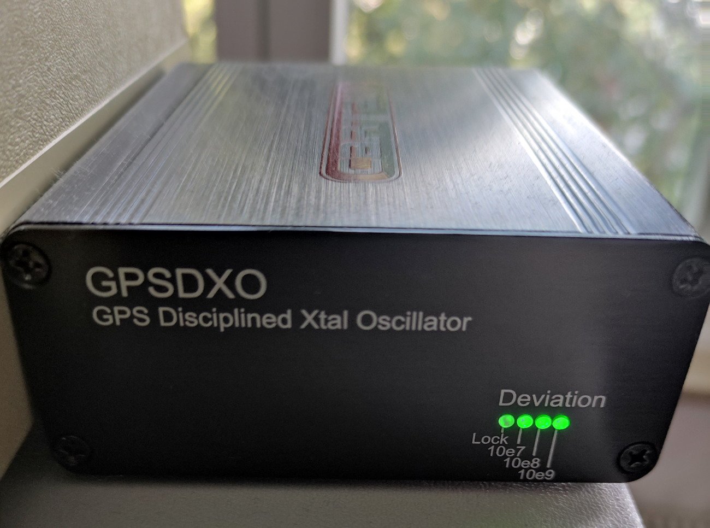
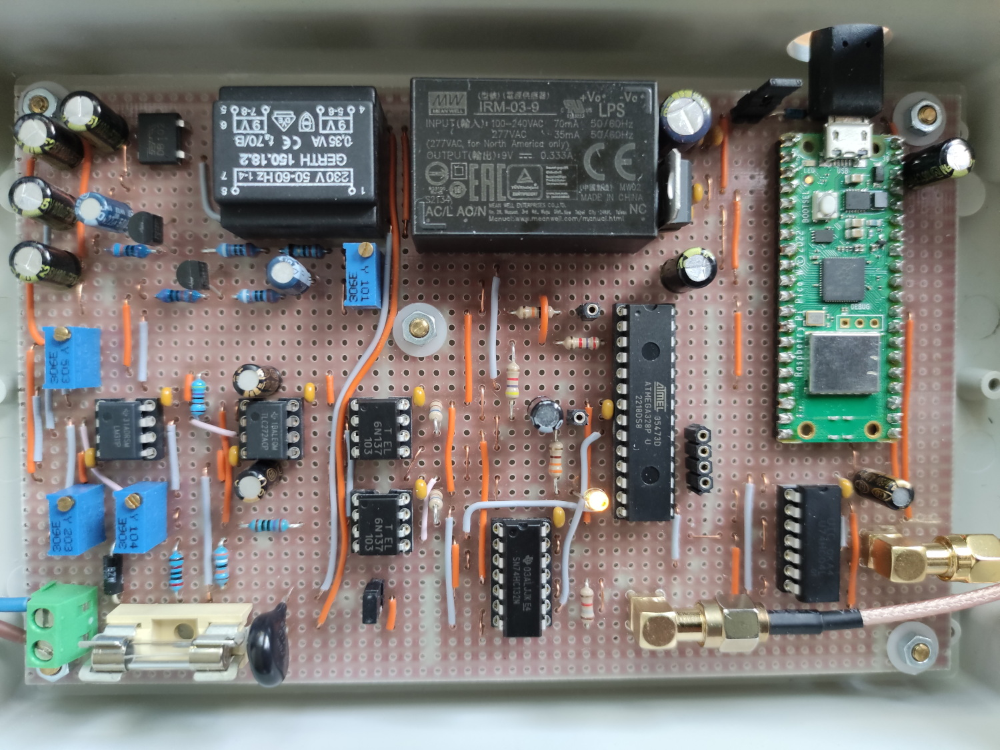
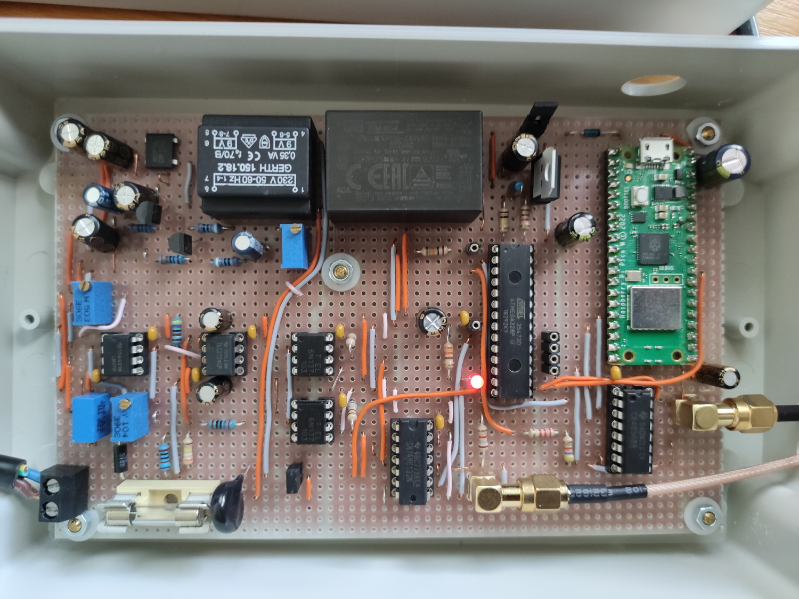
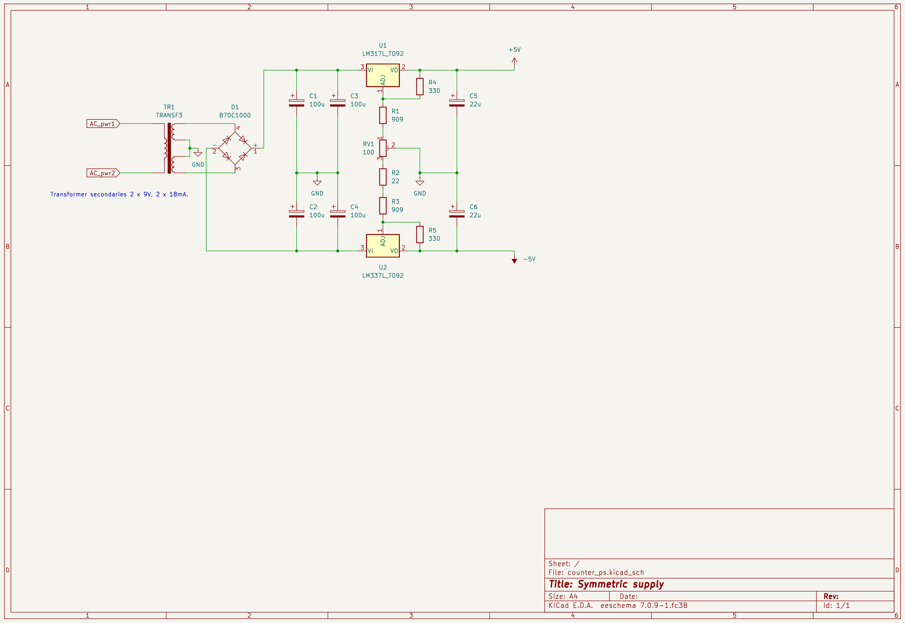

## Hardware

The mfm project consists of 4 hardware components. One of which is present twice.

* A GPS disciplined oscillator (GPSDO or GPSDXO) with 1PPS output

* An oven-controlled crystal oscillator (OCXO) with 10 MHz TTL output (clock), powered by a plug-in power supply.

* A board called a "distributor" for doubling the 10Mhz clock and 1PPS signals, powered via mains connection. Circuit diagram: Distributor.

* Two circuit boards with the circuit for measuring the mains frequency. Circuit diagrams: Counter ATmega328p v1 & v2. Both are almost identical and have 3 inputs:
  - Mains connection, for measurement and power supply
  - 10 MHz TTL clock for ATmega328 CPU
  - 1PPS

From now on I will call the two boards with the circuit for the mains frequency measurement Counters 1 & 2. The name Counter comes from the fact that the main task in frequency measurement is counting between two trigger events. The ATmega is at the first stage and sends a time stamp on every trigger. In the second stage the Pico W computes the frequency from the time stamps of the ATmega.


If you can get a GPSDO with OCXO cheaply and that outputs 10 MHz at TTL level, you would probably be better off taking that instead of my solution. It is also possible to use a single Counter and no Distributor. On the software side, this would not result in any adjustments (however, merging measured values, which is described for the mfm_server, no longer makes sense, as this requires two counters).


### GPSDO

The Cartain GPSDO is the cheapest I could find. It's working perfectly so far. It emits one pulse per second (1PPS also PPS), of approx. 2.5 Vpp. Every rising edge marks the beginning of a new second "accurate to an atomic clock".
In addition, it also outputs a 10 MHz sine wave. Since the crystal used is not an OXCO, but a voltage-controlled crystal (VCXO (?)), there is quite a bit of phase noise.





### OCXO & Distributor


By OCXO I mean the board on the left in the photo. The actual crystal oven, the metal box (see photo), is from CTI and used. Only the circuit board is new. There are of course better and more precise crystal ovens and circuits, but the accuracy is more than sufficient for this application. In the EEVblog forum, some people mentioned to have problems with the potentiometer setting, since the potentiometer was at the limit but the frequency of 10 MHz not exactly reached. I didn't have that problem.


The distributor is on the right in the photo and is simply a circuit with logic gates that double the corresponding signals. The 1PPS signal gets its voltage increased to 3.3 V.

Schematic `hardware/distributor/counter_distributor.kicad_sch`.


The distributor has 2 inputs and 4 outputs. 10 Mhz TTL to 2x 10 Mhz TTL as clock for the ATmegas. 1PPS to 2x 1PPS.

The "From OCXO" input is connected to the OCXO "OUT-TTL" output inside the box. The box therefore has an input for 1PPS and 5 outputs:
2x 10 MHz TTL out, 2x 1PPS out (3.3 Vpp), 1x sine 10 MHz from the OCXO.


In addition to the TTL output, the OCXO also has an “OUT-Sine” sine output. This is also led outside so that you can use a frequency counter to check whether the OCXO is exactly at 10 MHz. The GPSDO 10 Mhz sine output can be used as a reference.


### Counter 1 & 2

The Counters are identical except for two small differences. Both have a front and a back end. The separation is where the opto-isolators are. The ground of the +/-5 V supply voltages is coupled to the mains voltage in the front end. The mains voltage is separated by the opto-isolators. That's why there are two grounds GND (front end) and GND_2 (back end) and two power supplies.

The Counters do not necessarily have to be connected to 230 V. It is also possible with a plug-in power supply, which outputs an AC voltage of approx. 8 - 10 V. This must be connected to D1 (suppressor diode, also TVS diode). R1, the varistor RVAR1 and the fuse F1 are then omitted. But then you need a solution for the symmetrical +/-5V supply for the front end. More effort --although mandatory for everyone without an isolating transformer. Especially if you want to measure with a scope on the front end side.


Counter 1:


Counter 2:


The two are not built exactly as in the schematics. The reason for the linear regulator to the right of the IRMs is because the IRMs output is 9V. If you take the right IRM, one with a 5 V output, this isn't needed.

The signal path using Counter 1, schematic `hardware/counter_atmega328p_v2/counter_mcu_2.kicad_sch`.


Front end:
The input voltage is reduced to a fraction and clipped by the voltage divider R1, R2 and the suppressor diode D1. Then further reduced via RV2 and sent to the comparator U1. It compares the sine with a fixed value that comes via RV1. This always results in a change at the output of the comparator exactly when the mains voltage goes above or below 0V. This square wave signal is now decoupled by U3A and passed to 2 opto-isolators that separate the front from the back end.

Back end:
The signals from the 2 opto-isolators are combined into a single square wave signal by the S-R latch U4B, U4A. The ATmega only has one input capture input (pin 14). This input is used to stop the time in which the signal goes from 0->1 and from 1->0 (the source code always speaks of "rise" and "fall"). The accuracy results from the clock of the ATmega, which comes from the OCXO via the Distributor. If the mains frequency is exactly 50 Hz, the distance between two 0->1 edges, "rise", or two 1->0 edges, "fall", is exactly 200,000 cycles, with the clock of the ATmega at exactly 10 MHz. Results in 200000/(10000000 * s^-1) = 20ms = 1/(50 * s^-1) period time. The timestamps are sent to the Pico W via UART. Both MCUs are supplied with the 1PPS signal via U7E, U7F and U4D. I will describe why this has been done so in the software description.

The LED D2 on pin 13/PD7 is on when 50 time stamps have been transferred and off for exactly that long. So about half a second on and off (exactly half a second on and off if the frequency is exactly 50 Hz). 50 0->1 and 50 1->0 timestamps are transmitted, 100 in total, making 50 periods. It doesn't tell you _when_ a measurement is taking place. This is only due to the Pico W and when it starts processing timestamps is essentially a coincidence.

The two differences between Counter 1 (Counter ATmega328p v2) and Counter 2 (Counter ATmega328p v1) are that with Counter 1 the signal from RV2 goes to the _plus_ pin of the LM311 and with Counter 2 to the _minus_ pin. And secondly, the 1PPS signal path is different. The solution is better with Counter ATmega328p v2 IMO as far as the 1PPS signal path is concerned. This has no effect on the SW. The exact same software runs on both.

Note: The connections for ISP programming the ATmega are _not_ shown in the schematic.

Note: The power supply for the front end is in its own schematic: `hardware/counter_ps/counter_ps.kicad_sch`.


The reason for 2 counters is,
* that the measurements of both can be compared against each other.
* Reliability, especially when doing SW updates.
* Wiring of the LM311 in the front end is different, resulting in slightly different behavior.


#### Atmel ATmega328p

The ATmega328p is a very well-known representative from the Atmel AVR family. https://www.microchip.com/en-us/product/ATmega328
(Microchip bought Atmel in 2016).

I use it mainly because I knew it before and it has the input capture feature (pin 14 / PB0).

The ATmega is programmed using an In System Programmer (ISP). My ISP is https://guloshop.de/shop/Microcontroller-Programmierung/guloprog-der-Programmer-von-guloshop-de::70.html .
Outputs from `dmesg` when my ISP is connected via USB:


In order for the ATmega to use the 10 Mhz clock on pin 9 / XTAL1 instead of the internal one, the so-called fuse bits must be set for an "external oscillator >8 Mhz":
```
avrdude -p atmega328p -P usb -c usbasp -U lfuse:w:0xee:m -U hfuse:w:0xd9:m -U efuse:w:0xff:m
```

To do this, the `avrdude` tool must be installed, which is also required for writing to flash.

Here is a photo showing the connected ISP. The template shows the pin assignment.


The colors are specified by the ISP manufacturer and (very likely) cannot be transferred to other ISPs.


#### Raspberry Pico W

The Raspberry Pico W (actually Raspberry Pi Pico W) is quite new. It is based on the RP2040 MCU developed by Raspberry Pi, a dual ARM Cortex M0+ chip. Clocked at 133 MHz.
https://www.raspberrypi.com/documentation/microcontrollers/raspberry-pi-pico.html#raspberry-pi-pico-w

I use it mainly because it has WiFi, a well-documented API, and a low price.

Although the voltage supply is designed for 5V, the Pico W converts it to 3.3V. All I/O pins may therefore only be operated with a maximum of 3.3V. 3.3V for your own components can be tapped from the Pico W (pin 36/3V3). This is useful for level shifting 3.3 V <-> 5 V.

The WiFi is very weak, at least for me on the strip grid board (epoxy). I therefore have a dedicated WiFi access point in the immediate vicinity, which is exclusively for the two Pico Ws. Even with that, the whole thing is still very responsive to EMI noise.

