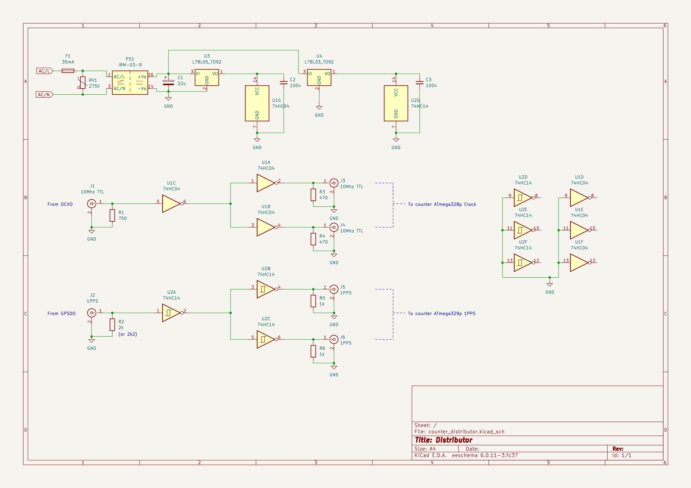

# mfm
Mains Frequency Measurement


## Über die zwei grundsätzlichen Arten Frequenzen zu messen


1. Man kann ein Gate für eine exakte Zeit (zB genau 1 Sekunde) öffenen und dann zählen wieviele Impulse, erkannt an einer Triggerschwelle, in dieser Zeit erkannt wurden. Dies ist das "klassische" Frequency Counting. Bei hohen Frequenzen funktioniert das ausgezeichnet.

2. Man kann warten bis der Trigger erreicht ist, lässt dann immer wieder neu triggern und bestimmt den Zeitunterschied zwischen den beiden Triggerevents. Um eine hohe Genauigkeit zu erreichen wird dies über eine längere Zeit gemacht, d.h. über mehrer Perioden des Eingangssignals.

Für eine genaue Bestimmung einer Frequenz im Bereich von 50 Hz, also einer sehr niedrigen Frequenz, mit einer Genauigkeit von mindestens +/ 1mHz eher besser, ist Verfahren Nr 2 offensichtlich das einzig geeignete. Bei Verfahren Nr 1 müsste man sehr lange Messen um genug Impulse gesehen zu haben.

Verfahren 2 hat allerdings einen Nachteil. Will man immer die selbe Anzahl an Perioden messen, was hier gemacht wird denn es werden immer 50 Perioden abgemessen, dann ist die MessDAUER abhängig vom MessWERT. Bei einer Frequenz über 50 Hz ist die Messung kürzer als 1 Sekunde. Bei einer Messung unter 50 Hz, länger. Dies zu erwähnen ist wichtig, denn viele mathematische Verfahren gehen von äquidistanten Werten aus. Und auch die Berechnung der Netzzeit benötigt Messwerte im Abstand von 1 Sekunde.

Die Platinen mit der Schaltung zur Netzfrequenzmessung werde ich ab jetzt Counter 1 & 2 nennen. Der Name Counter rührt daher, dass die Hauptaufgabe bei der Frequenzmessung das Zählen zwischen 2 Triggerevents ist. Die übernimmt der ATmega als erste Stufe, hier werden erstmal nur Zeitstempel bestimmt. In der zweiten Stufe wird aus den Zeitstempeln des ATmega vom Pico W eine Frequenz berechnet.


## Über Quarze

Es gibt verschiedene Arten eine Frequenz von zB exakt 10 Mhz zu erzeugen. Standardquarze, temperaturkompensierte Quarze und Quarzöfen (Oven Controlled Crystal Oscillator, OCXO) sind die gängisten Methoden, wobei jeweils eine Balance zwischen Kosten/Aufwand und Anforderung der Anwendung gefunden werden muss. Ein Standardquarz war für meine Geschmack zu ungenau. Standardquarze sind recht temperaturabhängig. Diese Temperaturabhängigkeit konnte ich in meinen Experimenten deutlich sehen. Eine Genauigkeit von +/- 1 mHz war so nicht zu erreichen, IMO.

Ein temperaturkompensierter Quarz (Temperature Compensated Crystal Oscillator, TCXO) korrigiert den Fehler nach Messung der Temperatur des Quarzes. Das Verfahren ist i.A. sehr viel genauer als ein Standardquarz. Diese sind aber schwer zu bekommen.

Ein Quarzofen hält die Temperatur des Quarzes auf einem konstantem Level. Die Genauigkeit der Frequenz hängt hier im wesentlichem nur noch von der Genauigkeit der Temperaturmessung und des Regelkreises ab. Man bekommt zB den von mir verwendeten Quarzofen für unter 20 Eur auf EBay aus China, inkl. Versand. Und für einen OCXO ist das sehr sehr günstig.  Und ist der Grund warum ich mir die Option TCXO nicht weiter angeschaut habe.


## Hardware

Das MFM Projekt (kurz MFM) besteht aus 4 hardware Komponenten. Wovon eine doppelt vorhanden ist.

* Ein GPS disciplined oscillator (GPSDO oder auch GPSDXO) mit 1PPS Ausgang

* Ein oven-controlled crystal oscillator (OCXO) mit 10 Mhz TTL Ausgang (Clock), versorgt über Steckernetzteil.

* Eine "Distributor" genannte Platine zum verdoppeln der 10Mhz Clock und 1PPS Signale, versorgt über Netzanschluss. Schaltplan: Distributor.

* Zwei Platinen mit der Schaltung zur Netzfrequenzmessung. Schaltpläne: Counter ATmega328p v1 & v2. Beide sind fast identisch und haben 3 Eingänge:
  - Netzanschluss, zur Messung und Stromversorgung
  - 10 Mhz TTL Clock für ATmega328 CPU
  - 1PPS

Wer günstig an einen GPSDO mit OCXO kommt, und der 10 MHz als TTL Level ausgibt, ist wohl besser beraten, den zu nehmen statt meiner Lösung. Es funktioniert dann auch nur mit einem Counter und ohne Distributor. Softwareseitig hätte das keine Anpassungen zur Folge.


### GPSDO

Der Carttrain GPSDO ist der billigste, den ich finden konnte. Er funktioniert bisher tadellos. Er gibt einen Impuls pro Sekunde aus (1PPS auch PPS), von c.a. 2,5 Vpp. Bei steigender Flanke ist "atomuhrgenau" jeweils der Beginn einer neuen Sekunde.
Zusätzlich gibt er auch einen 10 Mhz Sinus aus. Da der benutzte Quarz kein OXCO ist, sondern ein spannungsgesteuerter Quarz (VCXO (?)), gibt es ein recht hohes Phasenrauschen.


### OCXO & Distributor

Mit OCXO meine ich die Platine links im Bild.  Der eigentliche Quarzofen, die Metallkiste (siehe Photo), ist von CTI und gebraucht. Nur die Platine ist neu. Es gibt natürlich bessere und genauere Quarzöfen und Beschaltungen aber für diese Anwendung ist die Genauigkeit mehr als ausreichend. Im EEVblog Forum hat wohl der ein oder andere Probleme mit der Einstellung über das Poti, da das Poti am Anschlag ist aber die Frequenz von 10 Mhz nicht genau erreicht wird. Ich hatte das Problem nicht. 

Der Distributor ist rechts im Bild und einfach nur eine Schaltung mit Logikgattern die die entspr. Signale verstärken.


Der Distributor hat 2 Ein- und 4 Ausgänge. 10 Mhz TTL auf 2x 10 Mhz TTL als Clock für die ATmegas. 1PPS auf 2x 1PPS.

Der Eingang "From OCXO" ist innerhalb der Box mit dem OCXO TTL Ausgang verbunden. Somit hat die Box einen Eingang für 1PPS und 5 Ausgänge:
2x 10 Mhz TTL out, 2x 1PPS out (3,3 Vpp), 1x Sinus 10 Mhz vom OCXO.

Der OCXO hat neben TTL Ausgang auch einen mit Sinus. Dieser wird auch nach aussen geführt damit man mit einem Frequenzmesser aka Frequency Counter nachprüfen kann ob der QCXO auch genau 10 Mhz Ausgibt. Dabei kann der GPSDO 10 Mhz Sinus Out als Referenz benutzt werden.


### Counter 1 & 2

Die Counter sind bis auf zwei kleine Unterschiede identisch aufgebaut. Beide haben ein Front- und ein Backend. Die Trennung ist dort, wo die Optokoppler sind. Die Masse der +/-5 V Versorgungspannungen ist im Frontend an die Netzspannung gekoppelt. Durch die Optokoppler wird die Netzspannung abgetrennt. Deswegen gibt es zwei Massen GND (Frontend) und GND_2 (Backend) und zwei Spannungsversorgungen.

Die Counter müssen nicht zwingend an 230 V angeschlossen werden. Es geht auch mit einem Steckernetzteil was eine Wechselspannung von c.a. 8 - 10 V liefern sollte. Diese muss an D1 (Suppressordiode, auch TVS Diode) angelegt werden. R1, der Varistor RVAR1 und die Sicherung F1 entfallen dann. Dann braucht man allerdings noch eine Lösung für die symetrische +/-5V Versorgung des Frontends. Insg. daher die aufwändigere Lösung --allerdings Pflichtprogramm für jeden ohne Trenntrafo. Insb. dann wenn mit einem Oszi auf Front Ende Seite gemessen werden soll. 

Der Signalweg anhand Counter 1, Schaltplan counter_mcu_v2.


Frontend:
Über den Spannungsteiler R1,R2 und der Suppressordiode D1 wird die Eingangsspannung auf einen Bruchteil verringert und abgeschnitten. Über RV2 dann weiter verringert und an Komparator U1 gegeben. Dieser vergleicht den Sinus mit einem festem Wert der über RV1 kommt. Das ergibt am Ausgang des Komparators immer einen Wechsel genau dann wenn die Netzspannung über oder unter 0V geht. Dieses Rechtecksignal wird nun durch U3A entkoppelt und an 2 Optokoppler übergeben, die Front- und Backend trennen. 

Backend:
Die Signale aus den 2 Optokopplern werden durch ein S-R Latch U4B, U4A, zu einem Rechtecksingal vereint. Der ATmega hat nur einen Input Capture Eingang (Pin 14). Dieser Eingang wird benutzt um die Zeit zu stoppen in der das Rechteck 0 und 1 ist. Die Genauigkeit ergibt sich dabei aus der Clock des ATmegas, die über den Distributor vom OCXO kommt. Die Zeitstempel werden über UART an den Pico W geschickt. Beide MCUs werden über U7E, U7F und U4D mit dem 1PPS Signal versorgt. Warum das so ist beschreibe ich unter Software.


Die zwei Unterschiede zwischen Counter 1 (Counter ATmega328p v2) und Counter 2 (Counter ATmega328p v1) sind einmal, dass bei Counter 1 das Signal von RV2 an den _plus_ Pin vom LM311 geht und bei Counter 2 an den _minus_ Pin. Und zum anderem ist der 1PPS Signalweg anders. Die Lösung ist bei Counter ATmega328p v2 IMO besser. Eine Auswirkung auf die SW hat das nicht. Auf beiden läuft exakt die gleiche SW.

Hinweis: Die Anschlüsse zur Programmierung des ATmegas sind _nicht_ im Schaltplan eingezeichnet.

Hinweis: Das Netzteil für das Frontend ist in einem eigenem Schematic.


#### Atmel ATmega328p

Der ATmega328p ist ein sehr bekannter Vertreter aus der Atmel AVR Familie. https://www.microchip.com/en-us/product/ATmega328
(Microchip hatte Atmel 2016 gekauft).

Ich benutze ihn hauptsächlich weil ich ihn vorher schon kannte, und er das Input Capture Feature hat (Pin 14 / PB0).  


#### Raspberry Pico W

Der Raspberry Pico W (eigentlich Raspberry Pi Pico W) ist recht neu. Er basiert auf der von Raspberry Pi entwickelten RP2040 MCU, ein dual ARM Cortex M0+ Chip. Takt 133 Mhz.
https://www.raspberrypi.com/documentation/microcontrollers/raspberry-pi-pico.html#raspberry-pi-pico-w

Ich benutze ihn hauptsächlich weil er Wlan, eine gut dokumentierte API und einen geringen Preis hat.

Zwar ist die Spannungsversorung auf 5V ausgelegt, sie wird aber vom Pico W auf 3,3V umgewandelt. Alle I/O Pins dürfen somit nur mit max. 3,3V betrieben werden. 3,3V für eigene Bauteile können beim Pico W abgegriffen werden (Pin 36/ 3V3). Das ist nützlich für das level shifting 3,3 V <-> 5 V.


## Software

Die Software besteht aus 4 Komponenten. Eine Embedded SW für jeweils ATmega und Pico W. Einem Server, der die Daten die per WLan reinkommen, entgegennimmt. Und einem einfachen Tool zur graphischen Ausgabe der Daten.

### Embedded

Um die krosskompilierte SW auf die MCUs zu übertragen werden 2 völlig verschiedene Methoden benutzt. Der ATmega wird über einen In System Programmer (ISP) programmiert. Der Pico W hat einen Taster. Wird der beim Einschalten des Pico Ws gehalten, so geht der Pico W in eine spezielle Boot-Sequenz (die nicht überschrieben werden kann). Damit kann man über USB einen "Massenspeicher" mounten und eine .uf2 Datei dort hinkopieren. Das erkennt der Pico W und überträgt diese dann in sein Flashspeicher.

Ich kann mir vorstellen, dass der Pico W zur Programmierung des Atmegas benutzt werden kann. Das habe ich aus Zeitmangel nicht verfolgt. Es hätte den Vorteil, dass man keinen extra ISP braucht. Allerdings braucht man wegen der 3,3V I/O Spannung des Picos einen Treiber (auch level shifter oder logic converter genannt) zur Umsetzung und da sehe ich Platzprobleme. Die man allerdings vermutlich nicht hätte, wenn man einen kleineren Vertreter der ATmel Serie nehmen würde (ATtiny).  Der ATmega328p ist für diese Anwendung klar überdimensioniert.


#### Atmel ATmega328p

Mein ISP https://guloshop.de/shop/Mikrocontroller-Programmierung/guloprog-der-Programmer-von-guloshop-de::70.html

Der Source für den ATmega ist hier:


Es gibt nur eine Datei: `main.c`. Da der ATmega nur die Zeitstempel zwischen den Flanken des Rechtecksignals bestimmt und diese per UART an den Pico W schickt, passiert hier nicht viel. Das 1PPS Signal wird benutzt um den Zähler für die Zeitstempel auf 0 zu setzen.

Damit das Makefile durchläuft muss die avr-gcc Toolchain installiert sein. Wenn der ISP im Makefile richtig angegeben wurde und angeschlossen ist, kann mit `make program` in einem Schritt kompiliert und geflashed werden.


#### Raspberry Pico W


Der Source für den Pico W ist hier:


Ich benutze kein OS. Der Programmierer legt fest, was auf den 2 Kernen des Pico Ws, Core0 und Core1, laufen soll. Ich habe es so aufgeteilt, dass die Annahme (über UART) und Verarbeitung der Zeitstempel, die vom ATmega kommen, auf Core1 passiert. Die Kommunikation mit dem Server auf Core0 (dort wird main() gestartet).

Der Wlan Chip benutzt Interrupts, die mit Core0 verdrahtet sind und daher kann der Wlan Code nur auf Core0 laufen.

Um eine genaue Zeit zur ermitteln, holt sich der Pico W periodisch die Zeit von mfm_server. Dieser gibt die Zeit des Hostrechners zurück, die ungenau ist, was kein Problem ist solange sie genau genug ist bezüglich um die richtige Sekunde zu bestimmen (der Hostrechner bekommt seine Zeit wiederum i.d.R. über NTP. Das Verfahren ist abhängig von der Netzwerklatenz). Diese wird nun mit dem 1PPS Signal abgeglichen und damit erhält man eine sehr genaue Zeit. 
Ich benutze nicht die Uhr (RTC) des Picos. Der Standardquarz des Picos macht eine ständige Korrektur der Zeit nötig, egal wie man es macht.  Der Pico hat einen Zähler der ab Start hochzählt. Zu diesem addiere ich die Mikrosekunden seit 1.1.1970 0 Uhr.  In einer Interruptroutine, die an das 1PPS Signal gekoppelt ist, wird jede Sekunde geschaut um wieviele Mikrosekunden der Zähler (+ Mikrosekunden seit 1.1.1970 0 Uhr) korrigiert werden muss.
Da die Zeitstempel des ATmegas ebenfalls mit dem 1PPS Signal synchronisiert sind, kann die Messzeit (zumindest in der Theorie) sehr genau bestimmt werden. Sobald eine Messung stattgefunden hat kommt vom Pico nur die Information in welcher Sekunde die Messung war und vom ATmega die Mikrosekunde (Start oder Ende der Messung).  Dabei ist es wichtig zu beachten, dass der Start oder das Ende der Messung nicht auf eine Sekundengrenze liegen müssen und dass eine Messung länger (oder kürzer) als eine Sekunde sein kann.

`conf.h` - Konfiguration wie MAINS_FREQ
`freq.c` - Empfängt Zeitstempel vom ATmega und berechnet daraus Frequenz. Läuft auf Core1.
`main.c` - enthält main() was auf Core0 startet, startet Core1. Empfängt auf Core0 die Daten die von `freq.c` in den `ringbuffer.c` geschrieben wurden und sendet sie an den mfm_server.
`ntime.c` - Bestimmung der genauen Zeit aus Kombination mit Zeit vom Linux PC und 1PPS.
`proto.c` - Protokoll-definition.
`ringbuffer.c` - Speichern von Messwerten wenn Netzwerkverbindung (kurz) nicht verfügbar.


Zunächst mal das C SDK einrichten. https://www.raspberrypi.com/documentation/microcontrollers/c_sdk.html#sdk-setup
Unter https://www.raspberrypi.com/documentation/microcontrollers/c_sdk.html#quick-start-your-own-project steht welche Linux Packages installiert werden müssen.

Git clone und Umgebungsvariable setzen.
```
git clone https://github.com/raspberrypi/pico-sdk.git

cd pico-sdk
git submodule update --init

export PICO_SDK_PATH=$HOME/<path to pico sdk>/pico-sdk/
```

In das Pico W Verzeichnis wechseln, cmake Aufruf.

```
cd embedded/Pico_W/

mkdir build
cd build

cmake -DPICO_BOARD=pico_w -DWIFI_SSID="<your SSID>" -DWIFI_PASSWORD="<your password>" ..
```

Zum Bauen `make -j9`.  Die UF2 Datei zum flashen ist unter `embedded/Pico_W/build/mfm/mfm_pico_w.uf2`  (747 kb).


### Auf Linux PC

Auf einem Linux PC laufen der mfm_server, der die Daten die über Wlan von den Pico Ws kommen annimmt, weiterverarbeitet und in Dateien schreibt. Diese können von einer GUI, dem "Binge Watcher" bzw mfm_bwatcher, gelesen werden. 

Die Ausgaben, die mit printf() gemacht werden, werden über USB übertragen. Dazu auf Linux PC `minicom -C minicom.log -b 115200 -o -D /dev/ttyACM0` eingeben, nachdem der Pico W gestartet wurde. Die Übertragung der Ausgaben über USB hängt sich bei mir manchmal auf (nach mehrere Stunden oder Tagen). Der Pico W läuft dann aber noch.


#### mfm_server

Der mfm_server sollte mit einem `make` direkt bauen.
Der Server startet pro Verbindung, also pro Counter, einen Thread. Die zwei Threads übergeben dann die Messwerte an einen Thread, der die Daten pro Counter rausschreibt und zusätzlich kombiniert. 

Der mfm_server ist (noch) kein richtiger Server, es fehlt das sog daemonizing, dazu gehört das Entkoppeln vom Terminal. Z.Z. gibt es auch keine Möglichkeit den Server mit einem Kontrollprogramm sauber runterzufahren.

`conn_slots.c` - jeder Pico W bekommt einen eigenen connection slot, nutzt die Pico ID um zu erkennen, dass der selbe Pico W sich erneut angemeldet hat.
`file_mgr.c` - File Management und Rotation.
`process_data.c` - Datenauswertung.
`proto.c` - Protokoll-definition, exakte kopie der Datei im embedded/Pico_W/mfm Verzeichnis.
`server.c`- Enhält main(), nimmt Netzwerkverbingen an und startet pro Pico W einen Thread.

Die Picos haben eine eindeutige ID, diese kann mit https://github.com/mcjurij/mfm/blob/85a41c4bb33529b7771d14aba3f1979061e204ab/embedded/Pico_W/mfm/main.c#L51 abgefragt werden. Im mfm_server dient sie insb. dazu die Dateinamen für die Counter-bezogenen Dateien zu bestimmen. An einem Beispieltag, ich nehme den 2023-09-25, wird das schnell klar. Mit us-Epoch sind die Mikrosekunden seit dem 1.1.1970 0 Uhr gemeint. Meine Pico Ws haben die IDs Counter 1: E661A4D41723262A, Counter 2: E661A4D41770802F.


| Dateiname                                | Inhalt        |
| ---------------------------------------- | ------------- |
|`meas_data_E661A4D41723262A_2023-09-25.txt`|Messwerte von Counter 1 mit us-Epoch Zeit|
|`meas_data_E661A4D41770802F_2023-09-25.txt`|Messwerte von Counter 2 mit us-Epoch Zeit|
|`meas_data_local_E661A4D41723262A_2023-09-25.txt`|Messwerte von Counter 1 mit lokaler Zeit|
|`meas_data_local_E661A4D41770802F_2023-09-25.txt`|Messwerte von Counter 2 mit lokaler Zeit|
|`meas_sgfit_E661A4D41723262A_2023-09-25.txt`|Messwerte von Counter 1 mit us-Epoch Zeit, mit Interpolation & Savitzky-Golay Filter|
|`meas_sgfit_E661A4D41770802F_2023-09-25.txt`|Messwerte von Counter 2 mit us-Epoch Zeit, mit Interpolation & Savitzky-Golay Filter|
|`meas_sgfit_local_E661A4D41723262A_2023-09-25.txt`|Messwerte von Counter 1 mit lokaler Zeit, mit Interpolation & Savitzky-Golay Filter|
|`meas_sgfit_local_E661A4D41770802F_2023-09-25.txt`|Messwerte von Counter 1 mit lokaler Zeit, mit Interpolation & Savitzky-Golay Filter|
|`meas_merge_2023-09-25.txt`|Verschmolzene Messwerte von Counter 1 & 2 mit us-Epoch Zeit, mit Interpolation|
|`meas_merge_sgfit_2023-09-25.txt`|Verschmolzene Messwerte von Counter 1 & 2 mit us-Epoch Zeit, mit Interpolation & Savitzky-Golay Filter|
|`gridtime_2023-09-25.txt`|Netzzeit mit us-Epoch Zeit|
|`gridtime_local_2023-09-25.txt`|Netzzeit mit lokaler Zeit|
|`incidents_E661A4D41723262A_2023-09-25.txt`|Incidents von Counter 1|
|`incidents_E661A4D41770802F_2023-09-25.txt`|Incidents von Counter 2||

Die Interpolation ist einfach zwischen 2 Messwerten linear interpoliert, und zwar so, dass man einen Wert pro Sekunde erhält. Der Savitzky-Golay Filter kann (in dieser Form) nur mit äquidistanten Werten arbeiten. Bei `meas_merge_*` wird der Mittelwert aus den beiden Interpolationen von Counter 1 und 2 genommen. Bei `meas_merge_sgfit_*` wird für Counter 1 & 2 jeweils erst interpoliert, dann jeweils der Savitzky-Golay Filter angewendet und danach der Mittelwert von diesen beiden Werten genommen.

Die Netzzeit wird aus den Messwerten berechnet die in `meas_merge_sgfit_*` geschrieben werden.

Welchen Effekt der Savitzky-Golay Filter auf die Messwerte hat, kann man sehr schön im mfm_bwatcher sehen, in dem man sich zB. `meas_data_E661A4D41723262A_2023-09-25.txt` _und_ `meas_sgfit_E661A4D41723262A_2023-09-25.txt` anschaut. Implementation siehe  https://github.com/mcjurij/mfm/blob/5b119eb627beb55587a3f4324e777724062568a9/mfm_server/process_data.c#L553 


#### mfm_bwatcher

Ein einfaches Tool zur graphischen Ausgabe der Daten, ähnlich einem Funktionsplotter, aber mit ein paar speziellen Features für diese Anwendung. Es muss Qt 6 installiert sein. Aktuell benutze ich Qt 6.4.3.
Zum Konfigurieren des Projekts auf File->Open File or Project gehen, dann `mfm_bwatcher.pro` laden, dann bei "Configure Project" nur "Desktop ..." auswählen, und auf "Configure Project" Button klicken. Dann unten links auf das grüne Dreieck "Run" clicken. Damit wird gebaut und die mfm_bwatcher GUI gestartet.

