## Hardware

Das mfm Projekt besteht aus 4 hardware Komponenten. Wovon eine doppelt vorhanden ist.

* Ein GPS disciplined oscillator (GPSDO oder auch GPSDXO) mit 1PPS Ausgang

* Ein oven-controlled crystal oscillator (OCXO) mit 10 Mhz TTL Ausgang (Clock), versorgt über Steckernetzteil.

* Eine "Distributor" genannte Platine zum verdoppeln der 10Mhz Clock und 1PPS Signale, versorgt über Netzanschluss. Schaltplan: Distributor.

* Zwei Platinen mit der Schaltung zur Netzfrequenzmessung. Schaltpläne: Counter ATmega328p v1 & v2. Beide sind fast identisch und haben 3 Eingänge:
  - Netzanschluss, zur Messung und Stromversorgung
  - 10 Mhz TTL Clock für ATmega328 CPU
  - 1PPS

Die zwei Platinen mit der Schaltung zur Netzfrequenzmessung werde ich ab jetzt Counter 1 & 2 nennen. Der Name Counter rührt daher, dass die Hauptaufgabe bei der Frequenzmessung das Zählen zwischen 2 Triggerevents ist. Die übernimmt der ATmega als erste Stufe, hier werden erstmal nur Zeitstempel bestimmt. In der zweiten Stufe wird aus den Zeitstempeln des ATmega vom Pico W eine Frequenz berechnet.

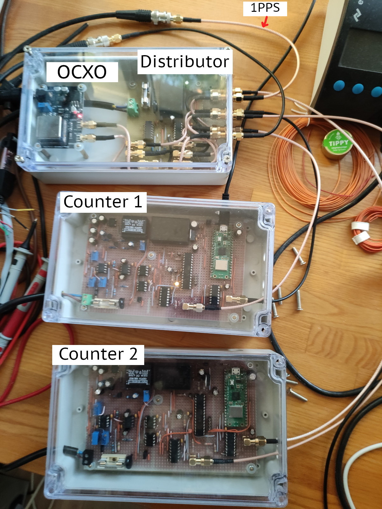

Wer günstig an einen GPSDO mit OCXO kommt, und der 10 MHz als TTL Level ausgibt, ist wohl besser beraten, den zu nehmen statt meiner Lösung. Es funktioniert dann auch nur mit einem Counter und ohne Distributor. Softwareseitig hätte das keine Anpassungen zur Folge (allerdings macht dann das Verschmelzen (merge) von Messwerten, was beim mfm_server beschrieben wird, keinen Sinn mehr, da dies zwei Counter braucht).


### GPSDO

Der Cartain GPSDO ist der billigste, den ich finden konnte. Er funktioniert bisher tadellos. Er gibt einen Impuls pro Sekunde aus (1PPS auch PPS), von c.a. 2,5 Vpp. Bei steigender Flanke ist "atomuhrgenau" jeweils der Beginn einer neuen Sekunde.
Zusätzlich gibt er auch einen 10 Mhz Sinus aus. Da der benutzte Quarz kein OXCO ist, sondern ein spannungsgesteuerter Quarz (VCXO (?)), gibt es ein recht hohes Phasenrauschen.

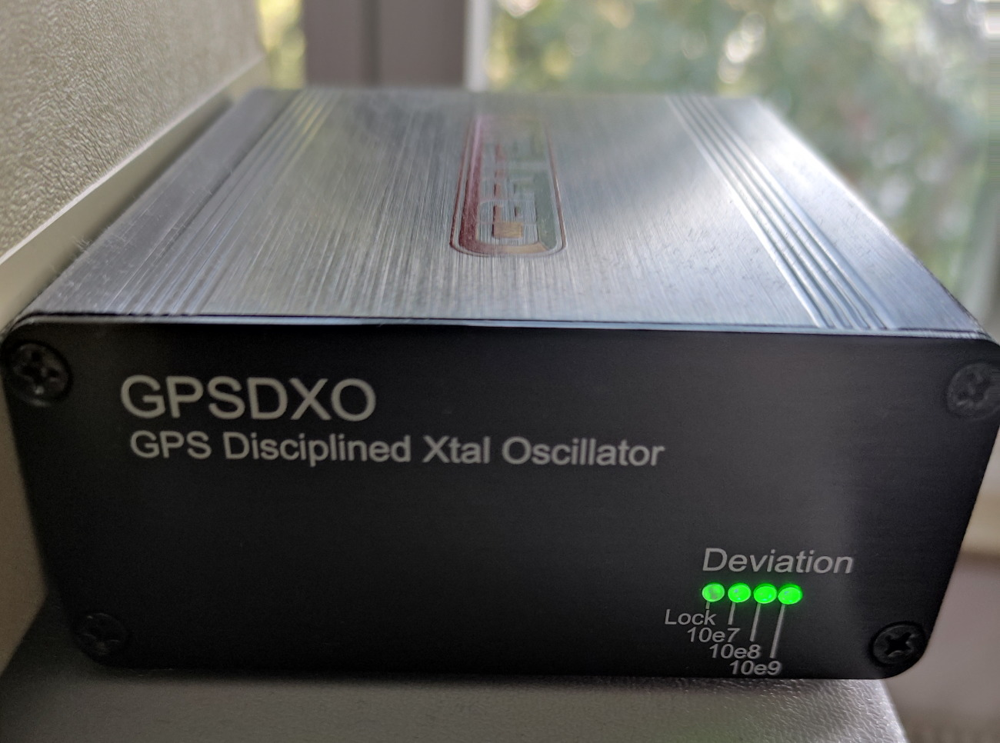


### OCXO & Distributor


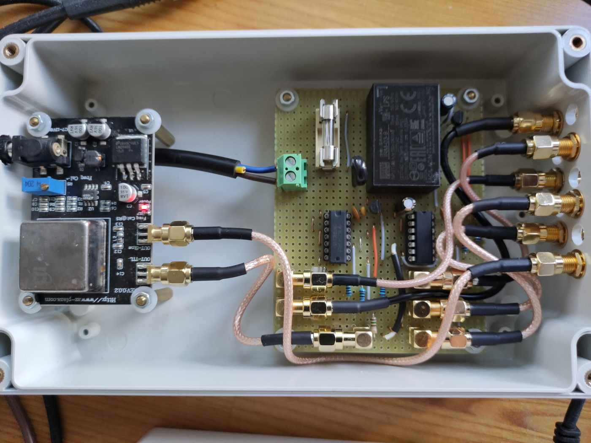

Mit OCXO meine ich die Platine links im Bild.  Der eigentliche Quarzofen, die Metallkiste (siehe Photo), ist von CTI und gebraucht. Nur die Platine ist neu. Es gibt natürlich bessere und genauere Quarzöfen und Beschaltungen aber für diese Anwendung ist die Genauigkeit mehr als ausreichend. Im EEVblog Forum hat wohl der ein oder andere Probleme mit der Einstellung über das Poti, da das Poti am Anschlag ist aber die Frequenz von 10 Mhz nicht genau erreicht wird. Ich hatte das Problem nicht. 

Der Distributor ist rechts im Bild und einfach nur eine Schaltung mit Logikgattern, die die entspr. Signale verdoppeln. Beim 1PPS wird noch die Spannung auf 3,3 V angehoben.
Schematic `hardware/distributor/counter_distributor.kicad_sch`.
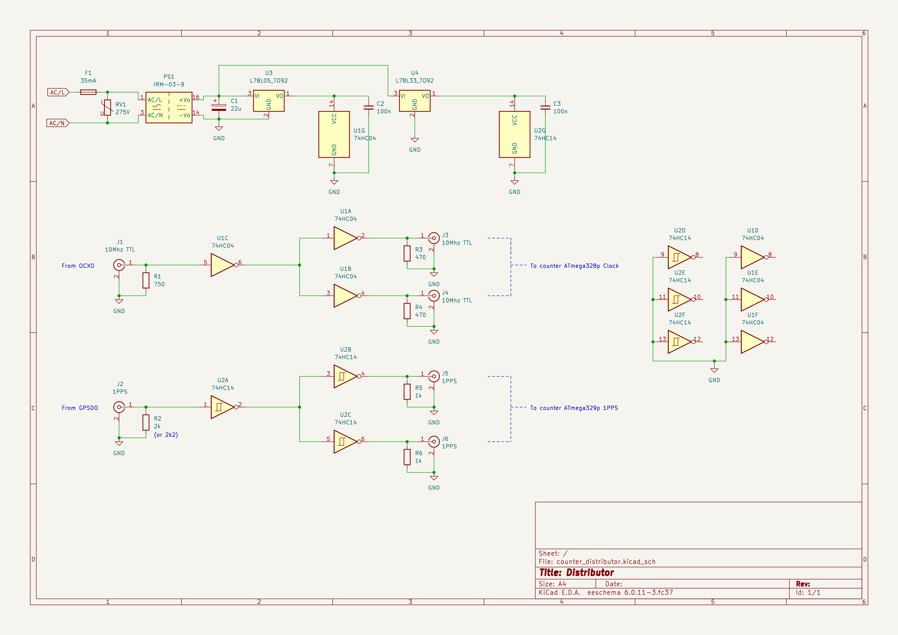

Der Distributor hat 2 Ein- und 4 Ausgänge. 10 Mhz TTL auf 2x 10 Mhz TTL als Clock für die ATmegas. 1PPS auf 2x 1PPS.

Der Eingang "From OCXO" ist innerhalb der Box mit dem OCXO "OUT-TTL" Ausgang verbunden. Somit hat die Box einen Eingang für 1PPS und 5 Ausgänge:
2x 10 Mhz TTL out, 2x 1PPS out (3,3 Vpp), 1x Sinus 10 Mhz vom OCXO.

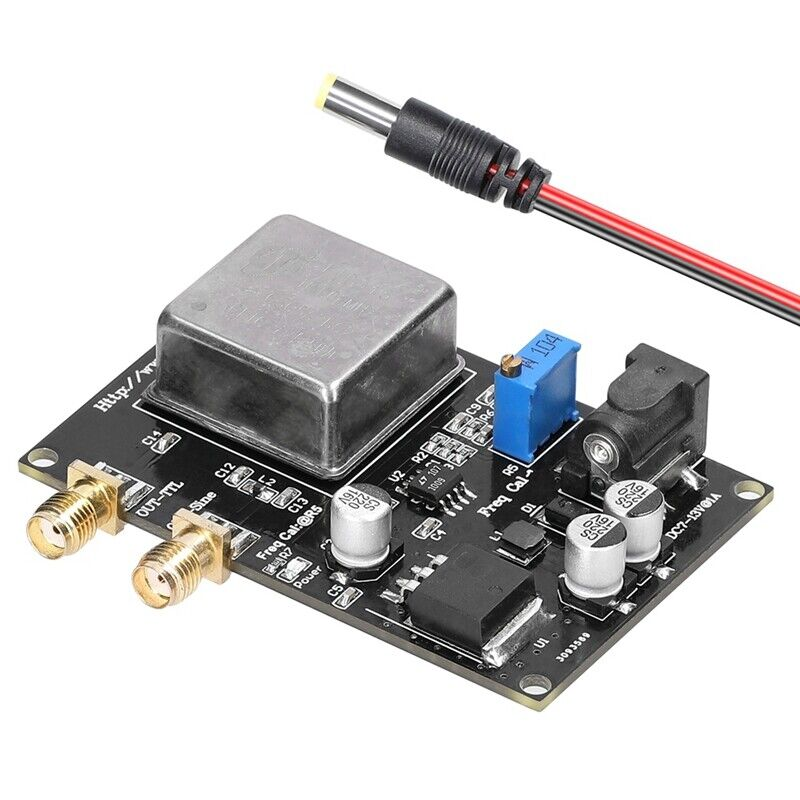

Der OCXO hat neben TTL Ausgang auch einen mit Sinus "OUT-Sine". Dieser wird auch nach aussen geführt damit man mit einem Frequenzmesser aka Frequency Counter nachprüfen kann, ob der OCXO auch genau 10 Mhz ausgibt. Dabei kann der GPSDO 10 Mhz Sinus Out als Referenz benutzt werden.

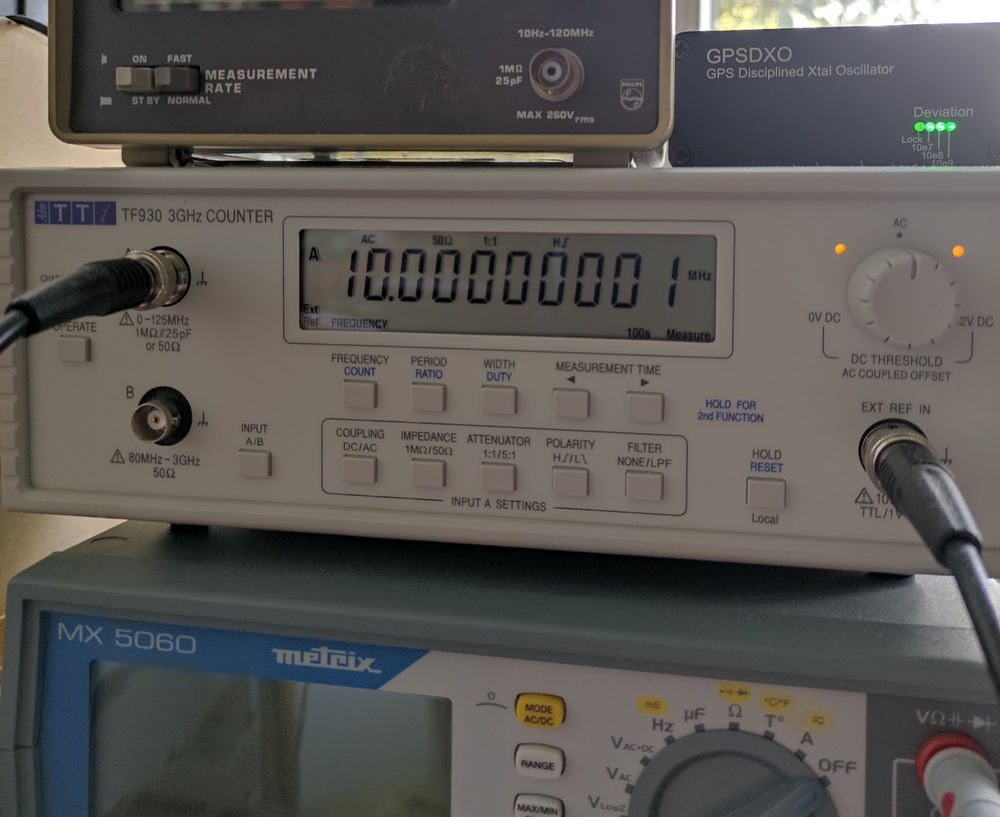

### Counter 1 & 2

Die Counter sind bis auf zwei kleine Unterschiede identisch aufgebaut. Beide haben ein Front- und ein Backend. Die Trennung ist dort, wo die Optokoppler sind. Die Masse der +/-5 V Versorgungspannungen ist im Frontend an die Netzspannung gekoppelt. Durch die Optokoppler wird die Netzspannung abgetrennt. Deswegen gibt es zwei Massen GND (Frontend) und GND_2 (Backend) und zwei Spannungsversorgungen.

Die Counter müssen nicht zwingend an 230 V angeschlossen werden. Es geht auch mit einem Steckernetzteil was eine Wechselspannung von c.a. 8 - 10 V liefern sollte. Diese muss an D1 (Suppressordiode, auch TVS Diode) angelegt werden. R1, der Varistor RVAR1 und die Sicherung F1 entfallen dann. Dann braucht man allerdings noch eine Lösung für die symetrische +/-5V Versorgung des Frontends. Insg. daher die aufwändigere Lösung --allerdings Pflichtprogramm für jeden ohne Trenntrafo. Insb. dann wenn mit einem Oszi auf Frontend Seite gemessen werden soll.

Counter 1:
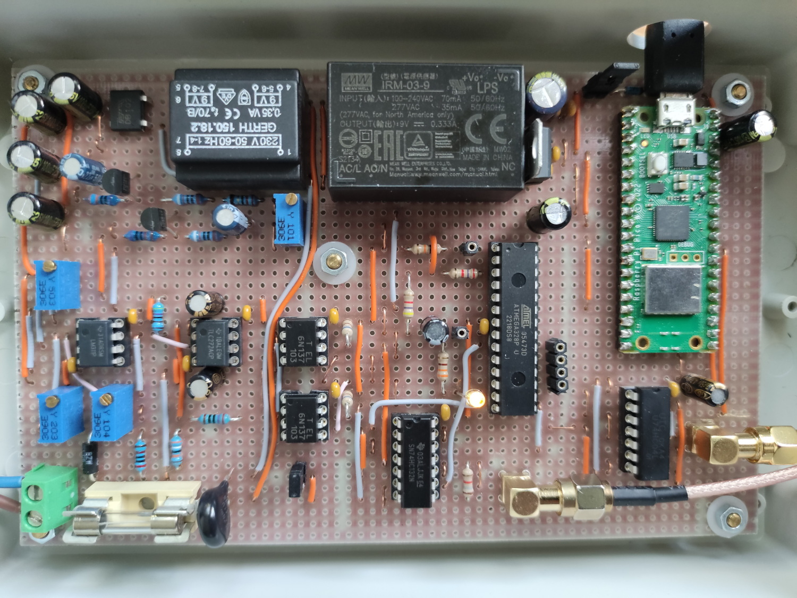

Counter 2:
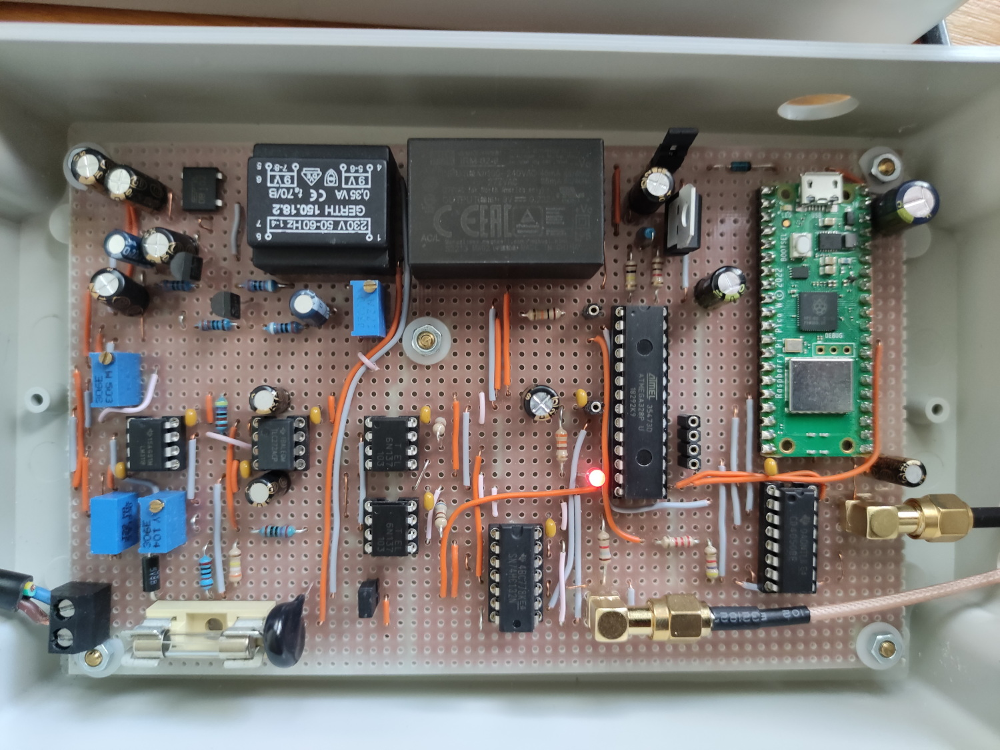

Die beiden sind nicht exakt wie in den Schematics aufgebaut. Der Grund für den Längsregler rechts von den IRMs ist, dass die IRM 9V liefern. Das kann man sich aber sparen, wenn man den richtigen IRM nimmt. Also einen mit 5 V am Ausgang.

Der Signalweg anhand Counter 1, Schaltplan `hardware/counter_atmega328p_v2/counter_mcu_2.kicad_sch`.
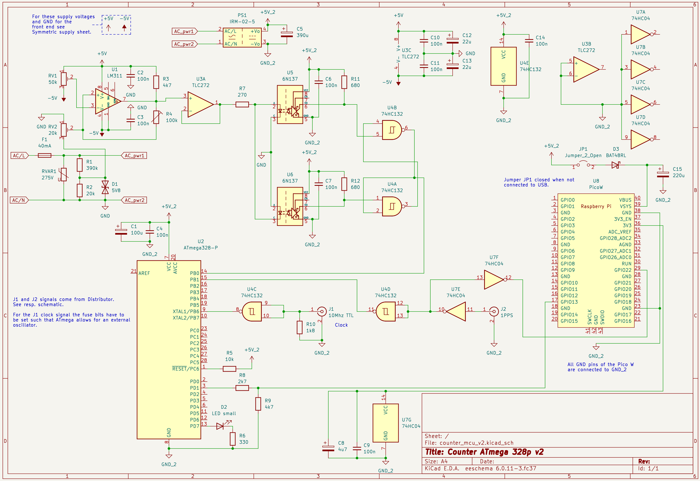


Frontend:
Über den Spannungsteiler R1,R2 und der Suppressordiode D1 wird die Eingangsspannung auf einen Bruchteil verringert und abgeschnitten. Über RV2 dann weiter verringert und an Komparator U1 gegeben. Dieser vergleicht den Sinus mit einem festem Wert der über RV1 kommt. Das ergibt am Ausgang des Komparators immer einen Wechsel genau dann wenn die Netzspannung über oder unter 0V geht. Dieses Rechtecksignal wird nun durch U3A entkoppelt und an 2 Optokoppler übergeben, die Front- und Backend trennen. 

Backend:
Die Signale aus den 2 Optokopplern werden durch ein S-R Latch U4B, U4A, zu einem Rechtecksingal vereint. Der ATmega hat nur einen Input Capture Eingang (Pin 14). Dieser Eingang wird benutzt um die Zeit zu stoppen in der das Rechteck von 0->1 und von 1->0 geht (im Source wird immer von "rise" und "fall" gesprochen). Die Genauigkeit ergibt sich dabei aus der Clock des ATmegas, die über den Distributor vom OCXO kommt. Wenn die Netzfrequenz genau 50 Hz beträgt, ist der Abstand zwischen zwei 0->1 Flanken, "rise", oder zwei 1->0 Flanken, "fall", genau 200000 Zyklen, bei einem Takt des ATmega von genau 10 MHz. Macht 200000/(10000000 * s^-1) = 20ms = 1/(50 * s^-1). Die Zeitstempel werden über UART an den Pico W geschickt. Beide MCUs werden über U7E, U7F und U4D mit dem 1PPS Signal versorgt. Warum das so ist beschreibe ich unter Software.

Die LED D2 an Pin 13/PD7 ist an wenn 50 Zeitstempel übertagen wurden und genau so lange aus. Also etwa eine halbe Sekunde an und aus (exakt eine halbe Sekunde an und aus, wenn die Frequenz exakt 50 Hz ist). Es werden 50 0->1 und 50 1->0 Zeitstempel übertagen, 100 in Summe, macht 50 Perioden. Hier kann man nicht erkennen _wann_ eine Messung statt findet. Das liegt nur am Pico W und wann der beginnt Zeitstempel zu verarbeiten ist quasi Zufall. 

Die zwei Unterschiede zwischen Counter 1 (Counter ATmega328p v2) und Counter 2 (Counter ATmega328p v1) sind einmal, dass bei Counter 1 das Signal von RV2 an den _plus_ Pin vom LM311 geht und bei Counter 2 an den _minus_ Pin. Und zum anderem ist der 1PPS Signalweg anders. Die Lösung ist bei Counter ATmega328p v2 IMO besser, was den 1PPS Signalweg angeht. Eine Auswirkung auf die SW hat das nicht. Auf beiden läuft exakt die gleiche SW.

Hinweis: Die Anschlüsse zur Programmierung des ATmegas sind _nicht_ im Schaltplan eingezeichnet.

Hinweis: Das Netzteil für das Frontend ist in einem eigenem Schematic.
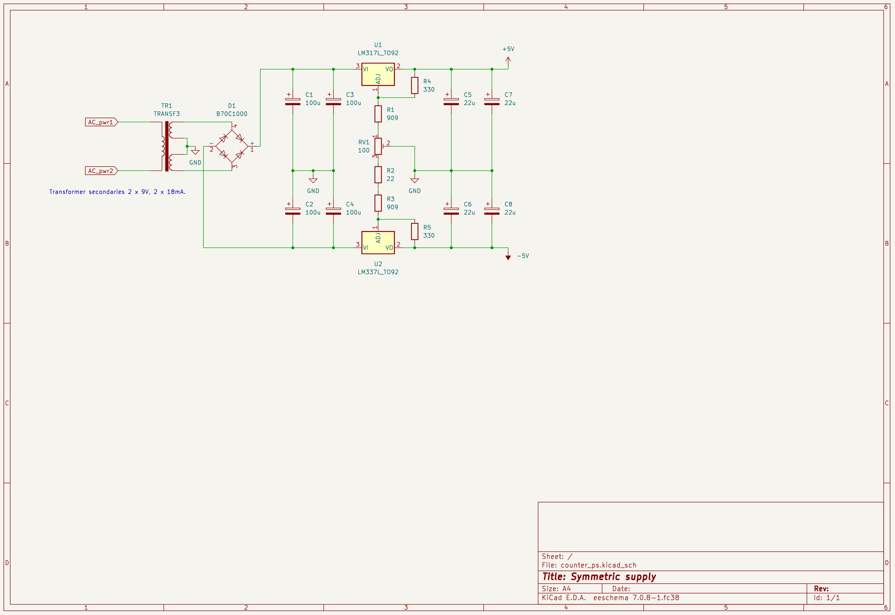

Der Grund für 2 Counter ist,
* dass die Messungen beider gegeneinander verglichen werden können.
* Ausfallsicherheit, insb bei SW Updates.
* Beschaltung des LM311 im Frontend unterschiedlich, dadurch etwas anderes Verhalten.


#### Atmel ATmega328p

Der ATmega328p ist ein sehr bekannter Vertreter aus der Atmel AVR Familie. https://www.microchip.com/en-us/product/ATmega328
(Microchip hatte Atmel 2016 gekauft).

Ich benutze ihn hauptsächlich weil ich ihn vorher schon kannte, und er das Input Capture Feature hat (Pin 14 / PB0).  

Der ATmega wird über einen In System Programmer (ISP) programmiert. Mein ISP https://guloshop.de/shop/Mikrocontroller-Programmierung/guloprog-der-Programmer-von-guloshop-de::70.html .
Ausgaben von `dmesg` wenn mein ISP per USB angeschlossen wird:

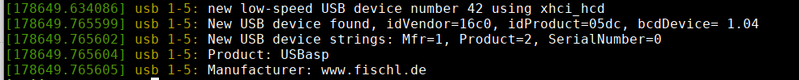


Damit der ATmega die 10 Mhz Clock an Pin 9 / XTAL1 benutzt, statt der internen, müssen die sog. fuse Bits für einen "external oscillator >8 Mhz" gesetzt werden:
```
avrdude -p atmega328p -P usb -c usbasp -U lfuse:w:0xee:m -U hfuse:w:0xd9:m -U efuse:w:0xff:m
```

Dazu muss das `avrdude` Tool installiert sein, was auch für das Schreiben ins Flash benötigt wird.

Hier ein Bild was den angeschlossenen ISP zeigt. Die Schablone zeigt die Anschlussbelegung.
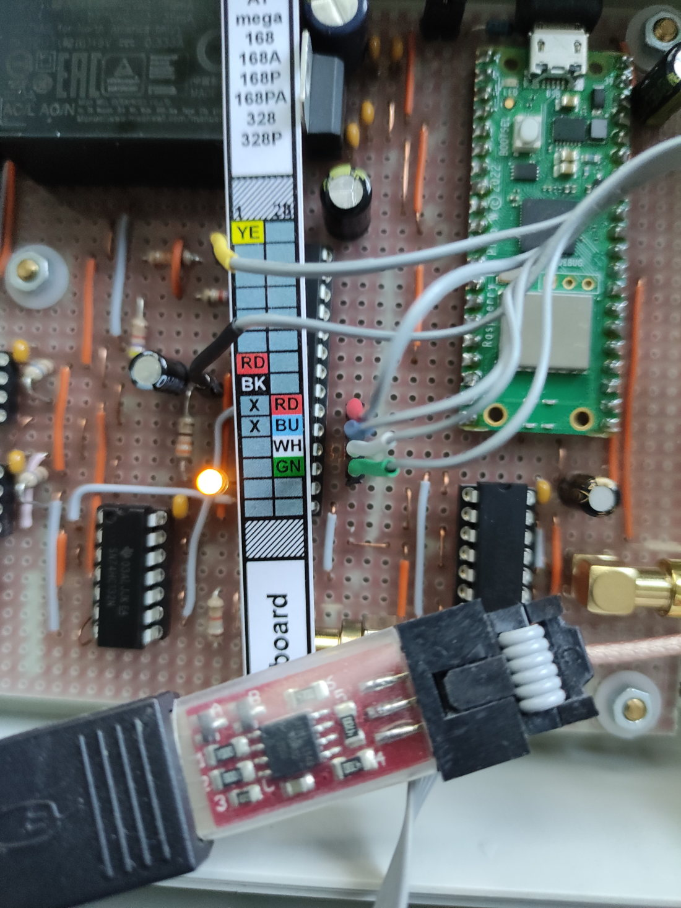

Dabei sind die Farben vom Hersteller des ISPs vorgegeben und (sehr wahrscheinlich) nicht auf andere ISPs übertragbar.


#### Raspberry Pico W

Der Raspberry Pico W (eigentlich Raspberry Pi Pico W) ist recht neu. Er basiert auf der von Raspberry Pi entwickelten RP2040 MCU, ein dual ARM Cortex M0+ Chip. Takt 133 Mhz.
https://www.raspberrypi.com/documentation/microcontrollers/raspberry-pi-pico.html#raspberry-pi-pico-w

Ich benutze ihn hauptsächlich weil er Wlan, eine gut dokumentierte API und einen geringen Preis hat.

Zwar ist die Spannungsversorung auf 5V ausgelegt, sie wird aber vom Pico W auf 3,3V umgewandelt. Alle I/O Pins dürfen somit nur mit max. 3,3V betrieben werden. 3,3V für eigene Bauteile können beim Pico W abgegriffen werden (Pin 36/ 3V3). Das ist nützlich für das level shifting 3,3 V <-> 5 V.

Das Wlan ist, zumindest bei mir auf der Streifenrasterplatine (Epoxyd), sehr schwach. Ich habe daher einen eigenen Wlan Access Point in direkter Nähe, der ausschliesslich für die Pico Ws ist. Selbst damit reagiert das Ganze immer noch sehr auf Störungen.

