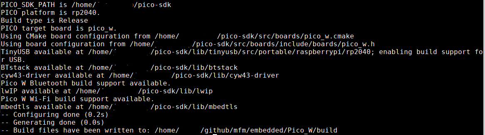
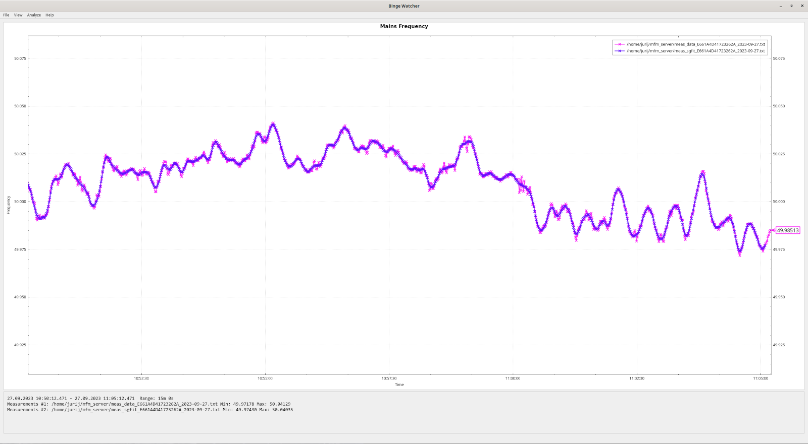
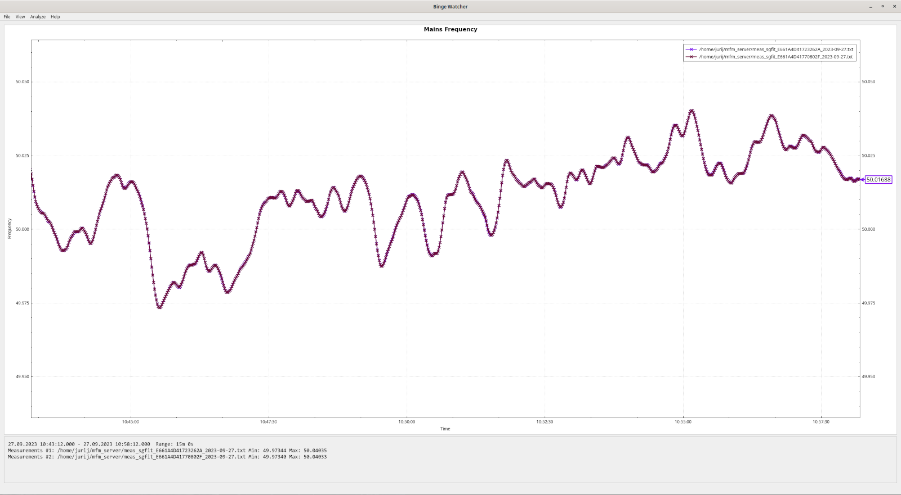
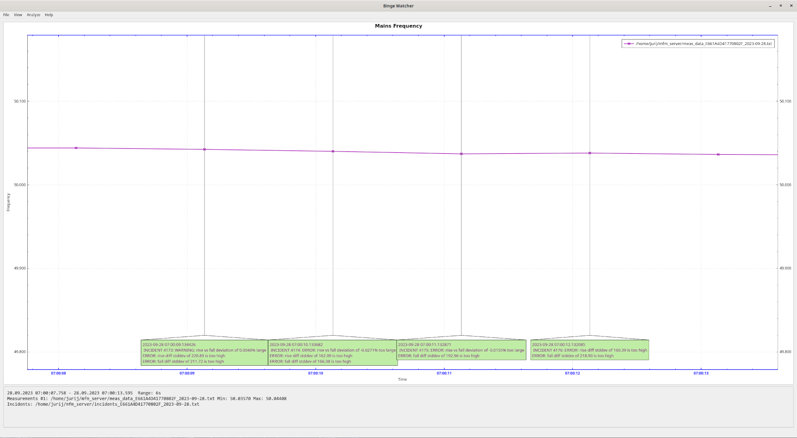

## Software

Die Software besteht aus 4 Komponenten. Eine Embedded SW für jeweils ATmega und Pico W. Einem Server, der die Daten die per WLan reinkommen, entgegennimmt. Und einem einfachen Tool zur graphischen Ausgabe der Daten.

### Embedded

Um die krosskompilierte SW auf die MCUs zu übertragen werden 2 völlig verschiedene Methoden benutzt. Der ATmega wird über einen In System Programmer (ISP) programmiert. Der Pico W hat einen Taster. Wird der beim Einschalten des Pico Ws gehalten, so geht der Pico W in eine spezielle Boot-Sequenz (die nicht überschrieben werden kann). Damit kann man über USB einen "Massenspeicher" mounten und eine .uf2 Datei dort hinkopieren. Das erkennt der Pico W und überträgt diese dann in sein Flashspeicher.

Ich kann mir vorstellen, dass der Pico W zur Programmierung des Atmegas benutzt werden kann. Das habe ich aus Zeitmangel nicht verfolgt. Es hätte den Vorteil, dass man keinen extra ISP braucht. Allerdings braucht man wegen der 3,3V I/O Spannung des Picos einen Treiber (auch level shifter oder logic converter genannt) zur Umsetzung und da sehe ich Platzprobleme. Die man allerdings vermutlich nicht hätte, wenn man einen kleineren Vertreter der ATmel Serie nehmen würde (ATtiny).  Der ATmega328p ist für diese Anwendung klar überdimensioniert. Zwar laufen ATmega/ATtiny auch mit 3,3V, ich weiss aber nicht ob das für 10Mhz reicht. Und an den Eingängen des ATmega/ATtiny dürfte dann nicht mehr als 3,3 + 0,5 V angelegt werden. 


#### Atmel ATmega328p

Der Source für den ATmega ist hier:


Es gibt nur eine Datei: `main.c`. Da der ATmega nur die Zeitstempel zwischen den Flanken des Rechtecksignals bestimmt und diese per UART an den Pico W schickt, passiert hier nicht viel. Das 1PPS Signal wird benutzt um den Zähler für die Zeitstempel auf 0 zu setzen.

Damit das Makefile durchläuft muss die avr-gcc Toolchain und zum flashen der avrdude installiert sein. Wenn der ISP zu dem im Makefile passt und angeschlossen ist, kann mit `make program` in einem Schritt kompiliert und geflashed werden.


#### Raspberry Pico W


Der Source für den Pico W ist hier:


Ich benutze kein OS. Der Programmierer legt fest, was auf den 2 Kernen des Pico Ws, Core0 und Core1, laufen soll. Ich habe es so aufgeteilt, dass die Annahme (über UART) und Verarbeitung der Zeitstempel, die vom ATmega kommen, auf Core1 passiert. Die Kommunikation mit dem Server auf Core0 (dort wird main() gestartet).

Der Wlan Chip benutzt Interrupts, die mit Core0 verdrahtet sind und daher kann der Wlan Code nur auf Core0 laufen.

Um eine genaue Zeit zur ermitteln, holt sich der Pico W periodisch die Zeit von mfm_server. Dieser gibt die Zeit des Hostrechners zurück, die ungenau ist, was kein Problem ist solange sie genau genug ist bezüglich um die richtige Sekunde zu bestimmen (der Hostrechner bekommt seine Zeit wiederum i.d.R. über NTP. Das Verfahren ist abhängig von der Netzwerklatenz). Diese wird nun mit dem 1PPS Signal abgeglichen und damit erhält man eine sehr genaue Zeit. 
Ich benutze nicht die Uhr (RTC) des Picos. Der Standardquarz des Picos macht eine ständige Korrektur der Zeit nötig, egal wie man es macht.  Der Pico hat einen Zähler der ab Start hochzählt. Zu diesem addiere ich die Mikrosekunden seit 1.1.1970 0 Uhr.  In einer Interruptroutine, die an das 1PPS Signal gekoppelt ist, wird jede Sekunde geschaut um wieviele Mikrosekunden der Zähler (+ Mikrosekunden seit 1.1.1970 0 Uhr) korrigiert werden muss.
Da die Zeitstempel des ATmegas ebenfalls mit dem 1PPS Signal synchronisiert sind, kann die Messzeit (zumindest in der Theorie) sehr genau bestimmt werden. Sobald eine Messung stattgefunden hat kommt vom Pico nur die Information in welcher Sekunde die Messung war und vom ATmega die Mikrosekunde (Start/Ende der Messung). Der Zeitpunkt der Messung liegt in der Mitte zwischen Start und Ende der Messung. Dabei ist es wichtig zu beachten, dass der Start oder das Ende der Messung nicht auf einer Sekundengrenze liegen müssen und dass eine Messung länger (oder kürzer) als eine Sekunde sein kann.

- `conf.h` - Konfiguration wie MAINS_FREQ
- `freq.c` - Empfängt Zeitstempel vom ATmega und berechnet daraus Frequenz. Läuft auf Core1.
- `main.c` - enthält main() was auf Core0 startet, startet Core1. Empfängt auf Core0 die Daten die von `freq.c` in den `ringbuffer.c` geschrieben wurden und sendet sie an den mfm_server.
- `ntime.c` - Bestimmung der genauen Zeit aus Kombination mit Zeit vom Linux PC und 1PPS.
- `proto.c` - Protokoll-definition.
- `tcp_client.c` - Kommunikation mit dem mfm_server. Die lwip call-back API ist _sehr_ fummelig.
- `ringbuffer.c` - Speichern von Messwerten wenn Netzwerkverbindung (kurz) nicht verfügbar.


Zunächst mal das C SDK einrichten. https://www.raspberrypi.com/documentation/microcontrollers/c_sdk.html#sdk-setup
Unter https://www.raspberrypi.com/documentation/microcontrollers/c_sdk.html#quick-start-your-own-project steht welche Linux Packages installiert werden müssen.

Git clone und Umgebungsvariable setzen.
```
git clone https://github.com/raspberrypi/pico-sdk.git

cd pico-sdk
git submodule update --init

export PICO_SDK_PATH=$HOME/<path to pico sdk>/pico-sdk/
```

In das Pico W Verzeichnis wechseln, cmake Aufruf.

```
cd embedded/Pico_W/

mkdir build
cd build

cmake -DPICO_BOARD=pico_w -DWIFI_SSID="<your SSID>" -DWIFI_PASSWORD="<your password>" ..
```

Das sollte zu diesen Ausgaben führen. Ich habe meine Pfade hier geschwärzt.


Zum Bauen `make -j9`. Die UF2 Datei zum flashen ist unter `embedded/Pico_W/build/mfm/mfm_pico_w.uf2`  (747 kb).


### Auf Linux PC

Auf einem Linux PC läuft der mfm_server, der die Daten die über Wlan von den Pico Ws kommen annimmt, weiterverarbeitet und in Dateien schreibt. Diese können von einer GUI, dem "Binge Watcher" bzw mfm_bwatcher, gelesen werden. 

Die Ausgaben, die mit printf() gemacht werden, werden über USB übertragen. Dazu auf dem Linux PC `minicom -C minicom.log -b 115200 -o -D /dev/ttyACM0` eingeben, nachdem der Pico W gestartet wurde. Die Übertragung der Ausgaben über USB hängt sich bei mir manchmal auf (nach mehreren Stunden oder Tagen). Der Pico W läuft dann aber noch.


#### mfm_server

Der mfm_server sollte mit einem `make` direkt bauen.
Der Server startet pro Verbindung, also pro Counter, einen Thread. Die zwei Threads übergeben dann die Messwerte an einen Thread, der die Daten pro Counter rausschreibt und zusätzlich kombiniert. 

Der mfm_server ist (noch) kein richtiger Server, es fehlt das sog daemonizing, dazu gehört das Entkoppeln vom Terminal. Z.Z. gibt es auch keine Möglichkeit den Server mit einem Kontrollprogramm sauber runterzufahren.

- `conn_slots.c` - jeder Pico W bekommt einen eigenen connection slot, nutzt die Pico ID um zu erkennen, dass der selbe Pico W sich erneut angemeldet hat.
- `file_mgr.c` - File Management und Rotation.
- `process_data.c` - Datenauswertung.
- `proto.c` - Protokoll-definition, exakte Kopie der Datei im embedded/Pico_W/mfm Verzeichnis.
- `server.c`- Enhält main(), nimmt Netzwerkverbingen an und startet pro Pico W einen Thread.

Die Picos haben eine eindeutige ID, diese kann mit https://github.com/mcjurij/mfm/blob/85a41c4bb33529b7771d14aba3f1979061e204ab/embedded/Pico_W/mfm/main.c#L51 abgefragt werden. Im mfm_server dient sie insb. dazu die Dateinamen für die Counter-bezogenen Dateien zu bestimmen. Nachdem ein Pico W eine Verbindung zum mfm_server aufgebaut hat sendet er als erstes seine ID. An einem Beispieltag, ich nehme den 2023-09-25, wird das schnell klar. Mit us-Epoch sind die Mikrosekunden seit dem 1.1.1970 0 Uhr gemeint. Meine Pico Ws haben die IDs Counter 1: E661A4D41723262A, Counter 2: E661A4D41770802F.


| Dateiname                                | Inhalt        |
| ---------------------------------------- | ------------- |
|`meas_data_E661A4D41723262A_2023-09-25.txt`|Messwerte von Counter 1 mit us-Epoch Zeit|
|`meas_data_E661A4D41770802F_2023-09-25.txt`|Messwerte von Counter 2 mit us-Epoch Zeit|
|`meas_data_local_E661A4D41723262A_2023-09-25.txt`|Messwerte von Counter 1 mit lokaler Zeit|
|`meas_data_local_E661A4D41770802F_2023-09-25.txt`|Messwerte von Counter 2 mit lokaler Zeit|
|`meas_sgfit_E661A4D41723262A_2023-09-25.txt`|Messwerte von Counter 1 mit us-Epoch Zeit, mit Interpolation & Savitzky-Golay Filter|
|`meas_sgfit_E661A4D41770802F_2023-09-25.txt`|Messwerte von Counter 2 mit us-Epoch Zeit, mit Interpolation & Savitzky-Golay Filter|
|`meas_sgfit_local_E661A4D41723262A_2023-09-25.txt`|Messwerte von Counter 1 mit lokaler Zeit, mit Interpolation & Savitzky-Golay Filter|
|`meas_sgfit_local_E661A4D41770802F_2023-09-25.txt`|Messwerte von Counter 1 mit lokaler Zeit, mit Interpolation & Savitzky-Golay Filter|
|`meas_merge_2023-09-25.txt`|Verschmolzene Messwerte von Counter 1 & 2 mit us-Epoch Zeit, mit Interpolation|
|`meas_merge_sgfit_2023-09-25.txt`|Verschmolzene Messwerte von Counter 1 & 2 mit us-Epoch Zeit, mit Interpolation & Savitzky-Golay Filter|
|`gridtime_2023-09-25.txt`|Netzzeit mit Epoch Zeit|
|`gridtime_local_2023-09-25.txt`|Netzzeit mit lokaler Zeit|
|`incidents_E661A4D41723262A_2023-09-25.txt`|Incidents von Counter 1|
|`incidents_E661A4D41770802F_2023-09-25.txt`|Incidents von Counter 2|

Die Interpolation ist einfach zwischen zwei Messwerten linear interpoliert, und zwar so, dass man einen Wert pro Sekunde erhält. Der Savitzky-Golay Filter kann (in dieser Form) nur mit äquidistanten Werten arbeiten. Bei `meas_merge_*` wird der Mittelwert aus den beiden Interpolationen von Counter 1 und 2 genommen. Bei `meas_merge_sgfit_*` wird für Counter 1 & 2 jeweils erst interpoliert, dann jeweils der Savitzky-Golay Filter angewendet und danach der Mittelwert von diesen beiden Werten genommen.

Die Netzzeit wird aus den Messwerten berechnet die in `meas_merge_sgfit_*` geschrieben werden. In `gridtime_2023-09-25.txt` steht die Epoch Zeit in der ersten Spalte. Das sind die Sekunden seit dem 1.1.1970 0 Uhr.

Welchen Effekt der Savitzky-Golay Filter auf die Messwerte hat, kann man sehr schön im mfm_bwatcher sehen, in dem man sich zB. `meas_data_E661A4D41723262A_2023-09-25.txt` _und_ `meas_sgfit_E661A4D41723262A_2023-09-25.txt` anschaut. Implementation siehe  https://github.com/mcjurij/mfm/blob/5b119eb627beb55587a3f4324e777724062568a9/mfm_server/process_data.c#L553 

Der mfm_server hat ein Log-File `log.txt`. Dort finden sich verschiedene Dinge: Meldungen zum Zeitabgleich, Meldungen zur File Rotation, Meldungen zu unplausibel langen Abständen zwischen 2 Messungen, Meldungen zu empfangenen Incidents.

Zu Incidents schreibe ich weiter unten was.

#### mfm_bwatcher

Ein einfaches Tool zur graphischen Ausgabe der Daten, ähnlich einem Funktionsplotter, aber mit ein paar speziellen Features für diese Anwendung. Es muss Qt 6 installiert sein. Aktuell benutze ich Qt 6.4.3.
Zum Konfigurieren des Projekts auf File->Open File or Project gehen, dann `mfm_bwatcher.pro` laden, dann bei "Configure Project" nur "Desktop ..." auswählen, und auf "Configure Project" Button klicken. Dann unten links auf das grüne Dreieck "Run" clicken. Damit wird gebaut und die mfm_bwatcher GUI gestartet.

Der mfm_bwatcher versteht nur die Dateien die eine us-Epoch Zeit haben (wie zB `meas_data_E661A4D41770802F_2023-09-25.txt`), nicht die mit lokaler Zeit (wie zB `meas_data_local_E661A4D41770802F_2023-09-25.txt`). Die mit lokaler Zeit sind für andere Plotter wie zB gnuplot gedacht. Die Datei für die Netzzeit (zB `gridtime_2023-09-25.txt` siehe oben), darf nur die Epoch in der ersten Spalte haben.


Dieser Screenshot zeigt die Daten von Counter 1: `meas_data_E661A4D41723262A_2023-09-27.txt` und `meas_sgfit_E661A4D41723262A_2023-09-27.txt`. Man sieht den Effekt des Savitzky-Golay Filters.
Im "Follow mode" werden die Dateien vom mfm_server immer am Ende neu gelesen und der Graph im Sekundentakt erneuert. Zu erkennen ist der Follow mode an dem Kästchen mit Wert und Pfeil an der rechten y-Achse (im Source AxisTag genannt).


Dieser Screenshot zeigt die Daten von Counter 1: `meas_sgfit_E661A4D41723262A_2023-09-27.txt` und Counter 2: `meas_sgfit_E661A4D41770802F_2023-09-27.txt`. Die beiden Kurven liegen sehr genau übereinander, da die Savitzky-Golay Filter die Unterschiede fast komplett weg-smoothen.

Die Zeit auf der x-Achse ist immer die lokale Zeit.


### Incidents

Wenn der Pico W die Zeitstempel vom ATmega auswertet kann es passieren, dass Auffälligkeiten festgestellt werden. Dies führt dann zu einem Incident. Ob ein Incident vorliegt wird ab hier geprüft:
https://github.com/mcjurij/mfm/blob/bba71c24176cf02726d72ed47665e61a6f7a76e6/embedded/Pico_W/mfm/freq.c#L476

Es kann mehrere Incidents durch eine Messung geben. Der Hauptgrund für den Incident Mechanismus ist, dass ich in der Lage sein will zu erkennen, ob einer der beiden Counter
aufgrund von Alterungsprozessen, oder warum auch immer, mit der Zeit schlechtere Messungen liefert.


#### ERROR: measurement failed

https://github.com/mcjurij/mfm/blob/bba71c24176cf02726d72ed47665e61a6f7a76e6/embedded/Pico_W/mfm/freq.c#L481

Komplette Messung fehlgeschlagen.

#### ERROR: rise measurement failed

https://github.com/mcjurij/mfm/blob/bba71c24176cf02726d72ed47665e61a6f7a76e6/embedded/Pico_W/mfm/freq.c#L498

Messung der steigenden Flanken fehlgeschlagen.

#### ERROR: fall measurement failed
https://github.com/mcjurij/mfm/blob/bba71c24176cf02726d72ed47665e61a6f7a76e6/embedded/Pico_W/mfm/freq.c#L513

Messung der fallenden Flanken fehlgeschlagen.

#### NOTE: mains frequency of %.4f Hz too low

https://github.com/mcjurij/mfm/blob/bba71c24176cf02726d72ed47665e61a6f7a76e6/embedded/Pico_W/mfm/freq.c#L530

Netzfrequenz unter 49.9 Hz.

#### NOTE: mains frequency of %.4f Hz too high

https://github.com/mcjurij/mfm/blob/bba71c24176cf02726d72ed47665e61a6f7a76e6/embedded/Pico_W/mfm/freq.c#L544

Netzfrequenz über 50.1 Hz.

#### ERROR: rise vs fall deviation of %.4f%% too large

https://github.com/mcjurij/mfm/blob/bba71c24176cf02726d72ed47665e61a6f7a76e6/embedded/Pico_W/mfm/freq.c#L559

Abweichung der Messungen für fallende und steigende Flanken ist zu gross.

#### WARNING: rise vs fall deviation of %.4f%% large

https://github.com/mcjurij/mfm/blob/bba71c24176cf02726d72ed47665e61a6f7a76e6/embedded/Pico_W/mfm/freq.c#L573

Abweichung der Messungen für fallende und steigende Flanken ist gross.

#### WARNING: %.4f is too big of a jump

https://github.com/mcjurij/mfm/blob/bba71c24176cf02726d72ed47665e61a6f7a76e6/embedded/Pico_W/mfm/freq.c#L588

Sprung zwischen zwei aufeinanderfolgenden Messwerten zu gross.

#### ERROR: rise diff stddev of %.2f is too high

https://github.com/mcjurij/mfm/blob/bba71c24176cf02726d72ed47665e61a6f7a76e6/embedded/Pico_W/mfm/freq.c#L603

Die Standardabweichung der Messung mit steigenden Flanken ist zu gross.

#### ERROR: fall diff stddev of %.2f is too high

https://github.com/mcjurij/mfm/blob/bba71c24176cf02726d72ed47665e61a6f7a76e6/embedded/Pico_W/mfm/freq.c#L618

Die Standardabweichung der Messung mit fallenden Flanken ist zu gross.

#### ERROR: %d erratic diff(s)

https://github.com/mcjurij/mfm/blob/bba71c24176cf02726d72ed47665e61a6f7a76e6/embedded/Pico_W/mfm/freq.c#L634

Falsche Differenzen (im Code diffs genannt). Differenzen sind die Zeit zwischen zwei entweder steigenden oder fallenden Flanken.

#### WARNING: %d corrected diffs

https://github.com/mcjurij/mfm/blob/bba71c24176cf02726d72ed47665e61a6f7a76e6/embedded/Pico_W/mfm/freq.c#L650

Mehr als 4 korrigierte Differenzen. Differenzen müssen immer dann korrigiert werden, wenn auf ATmega Seite ein Zeitstempel bestimmt wurde der den letzten Überlauf des Zählerregisters noch nicht mitbekommen hatte.


#### Anzeigen von Incidents im mfm_bwatcher

Zu einer Datei mit Messwerten zB `meas_data_<Pico ID>__<Date>.txt` kann man auch eine `incidents_<Pico ID>_<Date>.txt` dazu laden. Mit gleicher Pico ID und gleichem Datum. Das sieht dann zB so aus:



Um jedes Incident lesen zu können muss man entlang der x-Achse sehr stark reinzoomen, da sie sich überlappen. Daher ist die x-Achse selektiert und blau angezeigt. Zoomen mit Mausrad.
Die ist ein typischer Fall von Incidents die durch ein Rundsteuersignal ausgelöst werden. Das dürften so 95% aller Incidents sein.

Das Einblenden der Incidents verbraucht im mfm_bwatcher sehr viel CPU, wenn man zusätzlich in den Follow mode geht. Das benutzte Widget (QCustomPlot) ist für diese Anwendung nicht optimiert.
